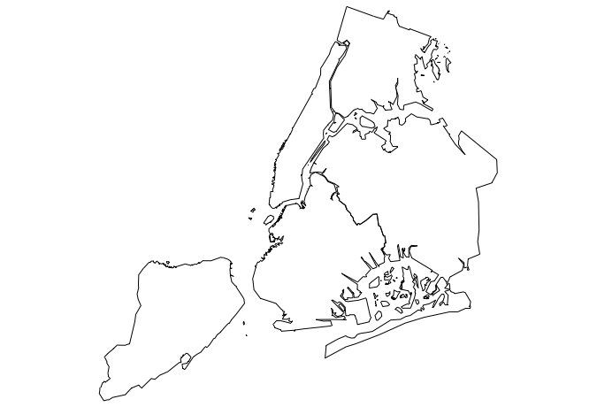

# nycmaps

This package provides New York City map data for use with the [maps](https://cran.r-project.org/web/packages/maps/index.html) package.

```
devtools::install_github("zachcp/nycmaps")
libary(nycmaps)
library(maps)
map(database="nyc")
```


```
#this should also work with ggplot and ggalt
nyc <- map_data("nyc")
gg  <- ggplot()
gg  <- gg + 
         geom_map(
           data=nyc, 
           map=nyc,
           aes(x=long, y=lat, map_id=region))
gg
```

nypdcrime <- read.csv("~/Downloads/NYPD_7_Major_Felony_Incidents.csv")

nypdcrime$Location  <- nypdcrime$Location.1
nypdcrime$Location  <- gsub("\\(","", nypdcrime$Location)
nypdcrime$Location  <- gsub("\\)","", nypdcrime$Location)
nypdcrime$Latitude  <- as.numeric(lapply(nypdcrime$Location, function(x){str_split(x,",")[[1]][[1]]}))
nypdcrime$Longitude <- as.numeric(lapply(nypdcrime$Location, function(x){str_split(x,",")[[1]][[2]]}))


nyc <- map_data("nyc")
gg <- ggplot(nypdcrime) +
        geom_map(data=nyc, 
                 map=nyc,
                 aes(x=long, y=lat, map_id=region)) +
        geom_point(data=nypdcrime, aes(x=Longitude, y=Latitude)) 


  geom_map()

ny2015 <- nypdcrime[nypdcrime$Occurrence.Year >= 2015,]
gg <- ggplot(ny2015) +
        geom_point(data=ny2015, aes(x=Longitude, y=Latitude, color=Offense)) +
        facet_grid(Occurrence.Month~Offense)
gg

gg <- ggplot() +
        geom_map(data=nyc, 
                 map=nyc,
                 aes(x=long, y=lat, map_id=region)) +
        
        geom_point(data=ny2015[ny2015$Offense == "MURDER",], 
        aes(x=Longitude, y=Latitude, color=Occurrence.Month)) +
        facet_wrap(~Occurrence.Month)
gg
